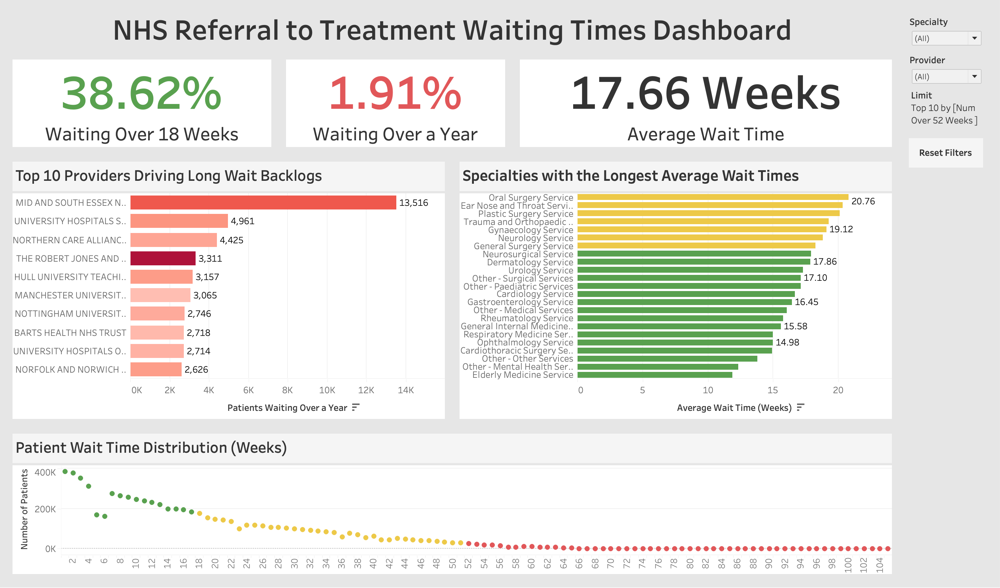

# NHS Referral to Treatment Waiting Times
End-to-end data analysis project using SQL and Tableau to analyse real data from the UK's National Health Service (NHS) regarding Referral to Treatment (RTT) time across different providers and specialties.

## NHS Referral to Treatment Waiting Times Dashboard

Live Link: (https://public.tableau.com/app/profile/jocelyn.sickler/viz/nhs_rtt/Dashboard)

## Project Overview:
This project analyses a real NHS dataset to explore real-world healthcare metrics such as:
- Average Wait Time
- Percentage of Patients Waiting Over 18 weeks (NHS target)
- Percentage of Patients Waiting Over 1 Year
- Providers Driving Long Wait (Over 1 Year) Backlogs
- Specialties with the Longest Average Wait Times
- Patient Wait Time Distribution

## Tools Used:
- SQL (PostgreSQL) for data cleaning, tranformation, and analysis
- Tableau for data visualisation

## Project Workflow:
- A raw dataset (~180,000 rows) was downloaded from the NHS website using the latest posted data (Jan 26): (https://www.england.nhs.uk/statistics/statistical-work-areas/rtt-waiting-times/rtt-data-2025-26/)
- The dataset was cleaned and transformed in SQL in order to extract relevant information for analysis. This transformed dataset is saved as rtt.csv
- The new dataset was explored and analysed in SQL to identify key performance indicators (KPIs) mentioned in the project overview.
- This information was then converted into an interactive dashboard built with Tableau that presents a visualisation of the insights uncovered and  allows users to filter by provider or specialty for deeper analysis.

## Data Transformation and Cleaning:
The original dataset contained weekly wait-time bands in a wide format (~120 columns). It also included patients who were still on the waiting list (Incomplete Pathways) as well as those who have already received treatment (Completed Pathways).

The dataset was transformed to only include patients who were still on the waiting list by:
- Filtering for 'Incomplete Pathways'
- Removing aggregate 'Total' rows so they don't interfere with future analysis
- Unpivoting 100+ wait-time columns using CROSS JOIN LATERAL into a single "weeks_waiting" column
- Removing unnecesary coding columns and renaming the existing columns for clarity (provider, specialty, weeks_waiting, patient_count)

## Key Findings:
- Over one-third (38.62%) of patients exceed the 18-week target
- Long waits (>52 weeks) are concentrated in specific providers (see "Top 10 Providers Driving Long Wait Backlogs" visualisation) 
- Significant variation exists across specialties, with surgical services showing higher delays (Oral Surgery had the longest average wait time at 20.76 weeks)
- While over 380,000 patients receive treatment within 1 week of being referred, the wait-time distribution chart is skewed to right, which drives up the overall average wait time (17.66 weeks) and indicates a significant backlog of patients waiting to receive treatment.
 

